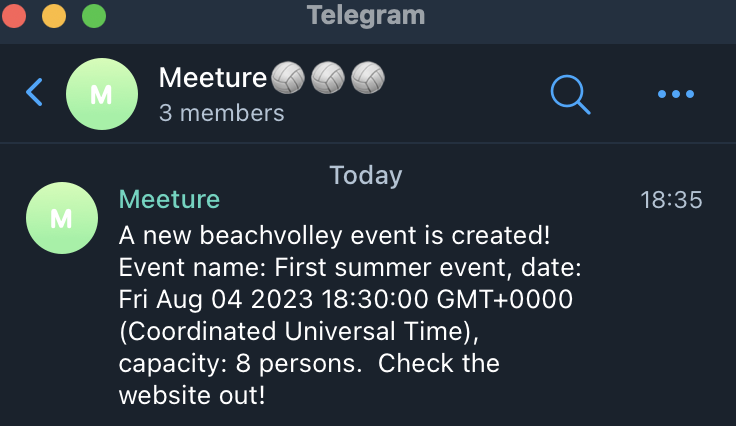

# Meeture
Welcome to Meeture! Meeture is a website designed for people looking to organize or find beach volleyball matches in Berlin, Germany. [You can access the platform by clicking here.](https://meeture-berlin.onrender.com/)

## Tech stack
The project is built using JavaScript, Express, NodeJS, Handlebars, Bootstrap

## Features
### 1. User authentication
Users can create an account and log in to the website using their email and password.

### 2. Event creation and modification
Users can create an event, select the date, time slot, the maximum number of participants up to 10, and select a location. Once an event is created, the user can modify and delete the event.

### 3. Event RSVP
Users can RSVP to events created by other users.

### 4. Display map 
Users can display the beach volleyball courts in Berlin on the map. The map shows the location that you are under the green flag and the seven beach volleyball courts in Berlin under the red flags. 

### 5. Telegram notifications
Whenever an event is created, users receive a notification about event date and place on Meeture telegram group. Here is the link to join the Telegram group: https://t.me/meeture

### 6. Responsive design
Meeture is designed to be responsive and mobile-friendly, allowing users to browse the platform from their smartphones and tablets

## Support
If you encounter any issues while using the platform or have suggestions for improving the application, please get in touch with the developer team.

## Contribution
We welcome contributions from anyone in the form of feedback, bug reports, feature requests, or code contributions. To contribute to this project, please follow these steps:
<ol>
<li>Fork this repository on GitHub.</li>
<li>Create a new branch for your changes and make your changes on that branch.</li>
<li>Submit a pull request to merge your changes into the main branch of this repository</li>
</ol>